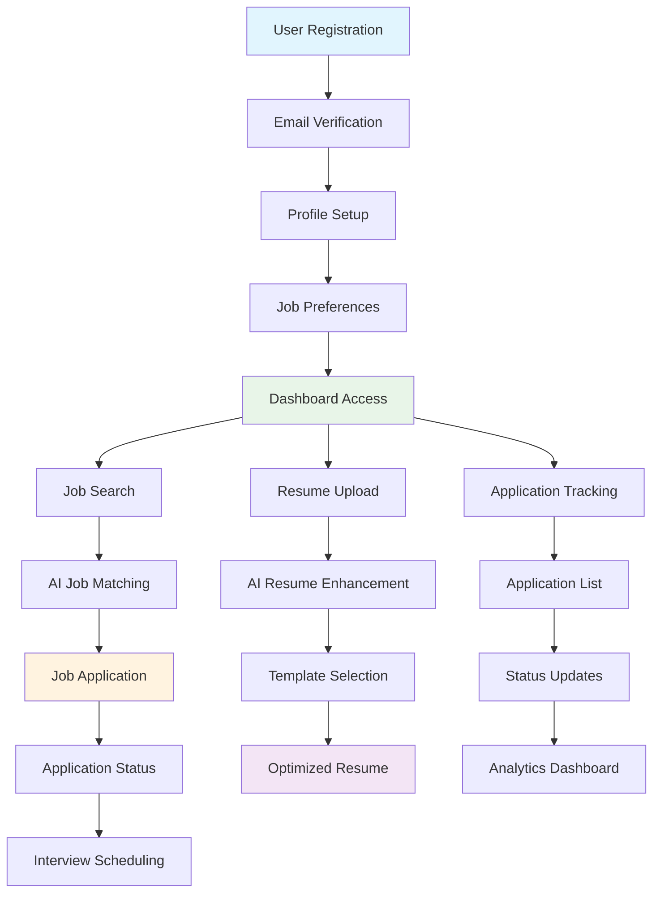
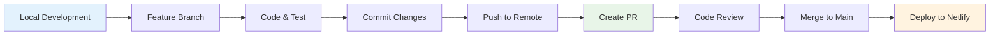
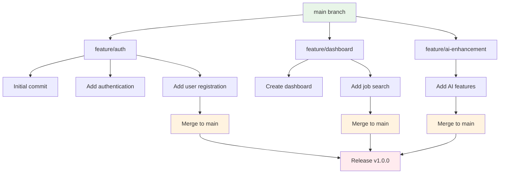

# My Job Search Agent 🤖

This is not part of Hackathorn. It is for production release

An AI-powered job search application built with Next.js, React, and TypeScript that helps users find, apply to, and manage job applications efficiently.

## 🚀 Features

- **AI-Enhanced Job Search**: Intelligent job matching based on user preferences
- **LaTeX Document Generation**: The AI writes your tailored resume and cover letter directly as
  LaTeX, which is compiled to a real PDF server-side. You get the PDF, the editable `.tex` source,
  and one-click **Open in Overleaf**.
- **Application Tracking**: Comprehensive dashboard to track job applications
- **Profile Management**: User profile creation and management
- **Authentication**: Email and Google sign-in with Supabase Auth
- **Responsive Design**: Modern UI built with Tailwind CSS
- **Real-time Updates**: Live application status tracking

## 🛠️ Tech Stack

- **Frontend**: React 18 + TypeScript
- **Framework**: Next.js
- **Styling**: Tailwind CSS
- **Authentication**: Supabase Auth
- **Database**: PostgreSQL (`pg`), schema in `db/migrations`
- **Routing**: React Router DOM
- **Icons**: Lucide React
- **Date Handling**: date-fns
- **Phone Validation**: libphonenumber-js
- **AI**: Google Gemini (server-side only)
- **Document rendering**: LaTeX, compiled via [Texapi](https://texapi.ovh)
- **Testing**: Vitest
- **Deployment**: Netlify / Google Cloud Run

## 📋 Prerequisites

Before running this project, make sure you have:

- **Node.js** (version 18 or higher)
- **pnpm** package manager (`corepack enable`) — not npm, see docs/SETUP.md
- **Git** for version control
- **Supabase project** (sign-in) and a **PostgreSQL** database (see `db/README.md`)

## ⚡ Quick Start

### 1. Clone the Repository

```bash
# Clone the repository
git clone https://github.com/agilepartners-ai/MyJobSearchAgent.git

# Navigate to project directory
cd MyJobSearchAgent
```

### 2. Install Dependencies

```bash
# Install all dependencies
pnpm install


```

### 3. Environment Setup

**→ Full walkthrough: [docs/SETUP.md](docs/SETUP.md)**

`.env.local` is already in the project root with every variable laid out and commented.
Fill it in, then verify with:

```bash
pnpm check:env
```

That makes a real call against Supabase, PostgreSQL, Gemini, Texapi and NVIDIA, so a bad key fails there
rather than when a user clicks Generate.

Document generation needs these server-side secrets on top of the Supabase client config:

| Variable | Purpose |
|---|---|
| `GEMINI_API_KEY` | Writes the LaTeX. **Not** `NEXT_PUBLIC_` — that would ship the key to every browser. |
| `TEXAPI_KEY` | Compiles LaTeX to PDF. Get one at [texapi.ovh](https://texapi.ovh). |
| `DATABASE_URL` + `PG_SSL_CA` | PostgreSQL: all application data, stored documents and the daily quota. |
| `DOCUMENT_SIGNING_SECRET` | Signs document download links. |

See `.env.example` for the complete list.

#### Deploying to Cloud Run

`ci-cd-cloudrun/cloudbuild.yaml` pulls the server-side secrets from Secret Manager rather than
build args, so they never end up inside the image. Create them once:

```bash
for s in gemini-api-key texapi-key database-url pg-ssl-ca document-signing-secret; do
  gcloud secrets create "$s" --replication-policy=automatic
done
# then add a version to each, e.g.
printf '%s' "$GEMINI_API_KEY" | gcloud secrets versions add gemini-api-key --data-file=-
```

Grant the Cloud Run service account `roles/secretmanager.secretAccessor`. Deploys use
`--update-env-vars` / `--update-secrets`, which merge rather than replace, so anything you set
directly on the service survives.

### 4. Run Development Server

```bash
# Start development server
pnpm dev

```

The application will be available at `http://localhost:3000`

## 🏗️ Build and Deployment

### Build for Production

```bash
# Create production build
pnpm build

```

### Preview Production Build

```bash
pnpm build && pnpm start
```

### Tests

```bash
# Unit tests (offline, fast)
pnpm test

# Also run the live LaTeX compilation tests
TEXAPI_KEY=your_key pnpm test
```

## 📁 Project Structure

```
MyJobSearchAgent/
├── public/                       # Static assets
├── docs/
│   └── self-hosted-latex-compiler.md   # Fallback plan if Texapi is outgrown
├── src/
│   ├── server/                   # Server-only — never imported by a component
│   │   ├── latex/
│   │   │   ├── templates/        # The document templates (.tex) — edit these to restyle
│   │   │   ├── sanitize.ts       # Validates & repairs AI-generated LaTeX
│   │   │   ├── buildDocument.ts  # preamble + AI body -> complete .tex
│   │   │   └── compile/          # LatexCompiler interface + Texapi implementation
│   │   ├── ai/
│   │   │   ├── prompts/system.md # The prompt — the macro contract lives here
│   │   │   ├── gemini.ts         # Gemini client with retry/backoff
│   │   │   └── generateLatex.ts  # Orchestration: generate -> validate -> compile
│   │   ├── auth/                 # Supabase token verification
│   │   ├── db/                   # Postgres pool, repositories, daily quota
│   │   └── storage/              # Generated documents + signed links
│   ├── pages/api/documents/      # generate | compile | url
│   ├── components/               # React components
│   │   ├── auth/                 # Authentication
│   │   ├── dashboard/            # Dashboard
│   │   │   └── documents/        # Results view, Overleaf button, LaTeX editor
│   │   └── forms/                # Form components
│   ├── hooks/ lib/ services/ types/ utils/
├── db/                           # Migrations, bootstrap SQL, hardening (see db/README.md)
├── tests/e2e/                    # Selenium/pytest end-to-end tests
├── vitest.config.mts             # Unit test configuration
├── next.config.mjs               # Next.js configuration
└── netlify.toml                  # Netlify deployment configuration
```

## 📄 How document generation works

```
resume text + job description
        │
        ▼
POST /api/documents/generate   ← authenticated; claims 1 of 25 daily generations
        │
        ├─ Gemini writes a LaTeX *body* using a fixed macro vocabulary
        ├─ sanitize.ts rejects unsafe commands and repairs unescaped % & $ # ^
        ├─ buildDocument.ts prepends the hand-written preamble
        ├─ Texapi compiles it to PDF
        └─ .tex and .pdf are stored in PostgreSQL, served through signed links
        │
        ▼
 UI: PDF preview │ Download PDF │ Download .tex │ Edit LaTeX │ Open in Overleaf
```

**To restyle every generated document**, edit `src/server/latex/templates/common.tex` (page setup,
colours, section headings) or `resume.macros.tex` / `coverletter.macros.tex` (entry layout). Run
`pnpm test` afterwards — the golden-file tests compile the template and check the PDF's text layer,
which is what catches a macro that silently swallows its content.

**If you add or rename a macro**, update `src/server/ai/prompts/system.md` and the allowlist in
`sanitize.ts` too. A test enforces that all three stay in sync — they must, because Texapi returns
no compile log, so a mismatch would fail every generation with no diagnostic.

### Open in Overleaf

Overleaf's [`/docs` endpoint](https://www.overleaf.com/devs) is an *import* endpoint, not a compile
API: it creates a project in the user's Overleaf account and opens it in a new tab. Nothing comes
back to us, which is why the app compiles its own PDFs. The button POSTs (rather than linking) so
document size is never constrained by URL length.

## 🌿 Git Workflow & CLI Commands

### Branch Management

```bash
# Check current branch
git branch

# Create and switch to new feature branch
git checkout -b feature/your-feature-name

# Switch to existing branch
git checkout branch-name

# Create new branch from current branch
git branch new-branch-name

# Delete local branch
git branch -d branch-name

# Delete remote branch
git push origin --delete branch-name
```

### Basic Git Operations

```bash
# Check status
git status

# Add files to staging
git add .                    # Add all files
git add filename            # Add specific file
git add *.js               # Add all JS files

# Commit changes
git commit -m "Your commit message"

# Push to remote branch
git push origin branch-name

# Pull latest changes
git pull origin branch-name
# push from branch if errors 
git push --set-upstream origin branch-name

# Fetch all branches
git fetch --all
```

### Working with Feature Branches

```bash
# 1. Create feature branch
git checkout -b feature/job-search-enhancement

# 2. Make your changes and commit
git add .
git commit -m "feat: add AI-powered job matching algorithm"

# 3. Push feature branch to remote
git push origin feature/job-search-enhancement

# 4. Create Pull Request (via GitHub/GitLab interface)

# 5. After PR approval, merge to main
git checkout main
git pull origin main
git merge feature/job-search-enhancement

# 6. Push updated main
git push origin main

# 7. Delete feature branch (optional)
git branch -d feature/job-search-enhancement
git push origin --delete feature/job-search-enhancement
```

### Deployment to Main Branch

```bash
# Complete workflow for pushing to main
git checkout main
git pull origin main
git merge your-feature-branch
git push origin main

# Or using rebase for cleaner history
git checkout main
git pull origin main
git checkout your-feature-branch
git rebase main
git checkout main
git merge your-feature-branch
git push origin main
```

### Advanced Git Commands

```bash
# Stash changes temporarily
git stash
git stash pop

# Reset to previous commit
git reset --hard HEAD~1

# View commit history
git log --oneline

# Create tag
git tag v1.0.0
git push origin v1.0.0

# Cherry-pick specific commit
git cherry-pick commit-hash

# Rebase interactive (clean up commits)
git rebase -i HEAD~3
```

## 🔧 Development Commands

```bash
# Install dependencies
pnpm install

# Start development server
pnpm dev

# Build for production
pnpm build

# Preview production build
pnpm start

# Run linter
pnpm lint

# Run linter with auto-fix
pnpm lint --fix
```

## 🔄 Application Workflow




## 🔄 Development Workflow



## 🔄 Git Branching Strategy



## 🚀 Deployment Configuration

### Deploy to Netlify

The project is configured for automatic deployment to Netlify:

1. **Connect Repository**: Link your GitHub repository to Netlify
2. **Build Settings**: 
   - Build command: `pnpm build`
   - Publish directory: `dist`
   - Node version: 18
3. **Environment Variables**: Add these to Netlify environment variables:
   - `NEXT_PUBLIC_SUPABASE_URL`
   - `NEXT_PUBLIC_SUPABASE_ANON_KEY`
   - `DATABASE_URL`, `PG_SSL_CA`, `PG_POOL_MAX`
   - `DOCUMENT_SIGNING_SECRET`
   - `GEMINI_API_KEY`, `TEXAPI_KEY`, `NVIDIA_API_KEYS`
   - `NEXT_PUBLIC_JSEARCH_API_KEY`
   - `NEXT_PUBLIC_JSEARCH_API_HOST`

### Manual Deployment

```bash
# Build and deploy manually
pnpm build
npx netlify deploy --prod --dir=dist
```

## 🧪 Testing

```bash
# Run tests (when configured)
pnpm test

# Run tests in watch mode
pnpm test:watch

# Run tests with coverage
pnpm test --coverage
```

## 🔍 Debugging

Every generation writes a request-scoped log with the same id in the browser console and the server
log. See [docs/AI_PIPELINE.md](docs/AI_PIPELINE.md#debugging) for the stages and what each one means.

## 🚀 Performance Optimization

- **Code Splitting**: Implemented with React.lazy()
- **Image Optimization**: WebP format with fallbacks
- **Bundle Analysis**: Use `pnpm build --analyze`
- **Caching**: Service worker for offline capabilities
- **Minification**: Automatic with Next.js build

## 🔒 Security

- **Environment Variables**: All sensitive data in `.env`
- **Data access**: every query is scoped by the user id from a verified Supabase session token; the database accepts connections only as a single least-privilege role over TLS
- **HTTPS**: Enforced in production
- **Content Security Policy**: Configured in Netlify
- **Input Validation**: Zod schema validation

## 📱 Browser Support

- Chrome (latest)
- Firefox (latest)
- Safari (latest)
- Edge (latest)

## 🤝 Contributing

1. Fork the repository
2. Create your feature branch (`git checkout -b feature/amazing-feature`)
3. Commit your changes (`git commit -m 'Add some amazing feature'`)
4. Push to the branch (`git push origin feature/amazing-feature`)
5. Open a Pull Request

## 📄 License

This project is licensed under the MIT License - see the LICENSE file for details.

## 🆘 Support

If you encounter any issues:

1. Check the [Issues](../../issues) page
2. Create a new issue with detailed description
3. Include error logs and environment details

## 🔮 Future Enhancements

- [ ] AI-powered interview preparation
- [ ] Salary negotiation assistant
- [ ] Company culture matching
- [ ] Network analysis and recommendations
- [ ] Mobile application
- [ ] LinkedIn integration
- [ ] Email automation for follow-ups

---

**Happy Job Hunting!** 🎯
